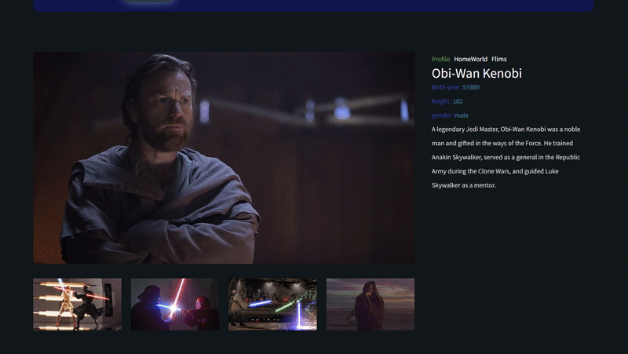

# 사이트 홈페이지 제작 (개인작업)

# 스타워즈 쇼핑몰

 
 

# 사용 기술  
- [X] HTML
- [X] CSS Module
- [X] React

## 프로젝트 주요 기능
1. 부모요소에서 프롭스(props) 전달을 통한 데이터 화면출력
2. 함수(map)를 통해 CSS 효과 적용을 위한 객체 데이터 변경 
3. 함수(find)를 통해 데이터 내부 id와 일치하는 데이터를 이용해 화면변경
4. useEffect 사용으로 특정한 값이 변경될때마다 화면에 반영되도록 되도록 순서를 부여
5.&& 연산자 통해 카테고리 탭 기능 구현

## 프로젝트 작업 순서
1. 자료조사 및 데이터 파일 배열속 객체형식으로 데이터 제작
2. 디자인 계획 및 마크업
3. HTML  / CSS Module / 순수 React 사용

# 프로젝트 기능 구현

### 1) 탭 방식 메뉴

* 데이터 내 'All character','Main character','Sub character' 정보로 탭기능
* 카테고리 해당 첫번째 캐릭터가 Gallery 나오도록 구현
* 카테고리 변경시 css 효과 적용

### 2) 상단 네비게이션

* 함수(map) 을 통한 네비게이션 바 출력
* 상단 인물 클릭시 각각 해당하는 인물로 갤러리 이미지 변경
* NEXT PREV 를 통한 인물변경 기능

### 3) 갤러리

* 갤러리 내부 하단의 이미지 클릭시 해당 이미지로 변경처리 
* 오른쪽 상단에 탭기능 추가로 해당하는 정보 출력

